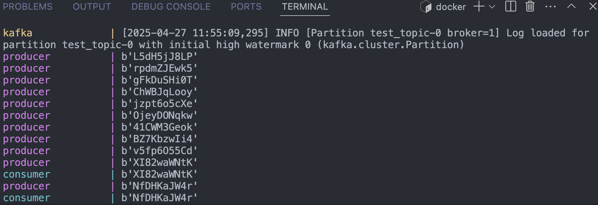
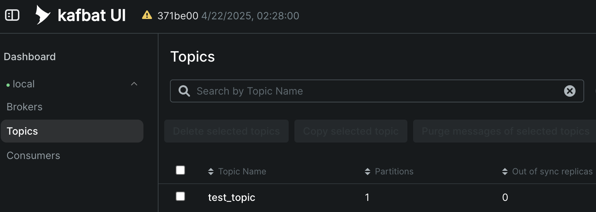

# Kafka: Python Example
This shows a quick setup of how to produce and consume messages with Kafka using Python.

## Setup

1. Start the containers by running `docker-compose up --remove-orphans --build --abort-on-container-exit`.
2. You should see messages being sent from the `producer`, then the `consumer` begins reading those messages midway through.

3. You can view Kafka Admin dashboard at http://127.0.0.1:8080/.

4. Stop the containers by running `docker-compose down --remove-orphans`.
